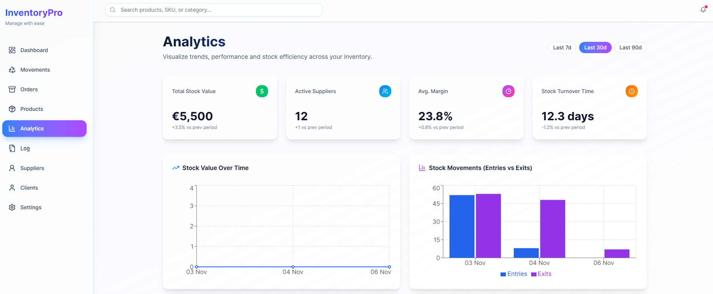
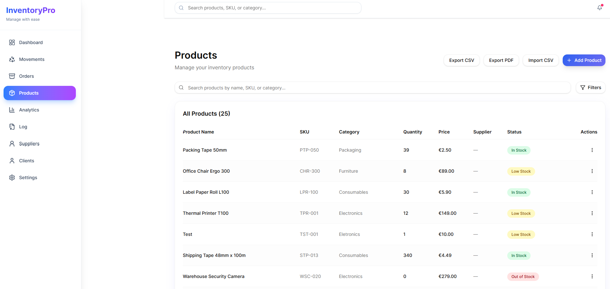

# OpenStock

A clean, fast market-insights dashboard built for founders, investors, and curious builders.  
OpenStock delivers real-time stock data, performance metrics, and intuitive visualizations in a minimal, distraction-free interface.

## 🚀 Features
- ⚡ Real-time stock managements (entries, exits, lookups, orders, etc...)  
- 📊 Clean charts and performance indicators  
- 🔍 Simple, fast search experience  
- 📱 Fully responsive design  
- 🎨 Modern UI with Tailwind CSS

## 🧠 Why I Built This
I wanted a lightweight, fast stock dashboard that gives you the essentials without the noise — perfect for people building businesses, tracking markets, or doing quick research. I used an improved version for my small business that requires managing stock.

## 🛠 Tech Stack
- Next.js  
- Tailwind CSS
- MongoDB
- Vercel  
- Custom endpoints

## 📸 Screenshots

## 🧪 Future Improvements
- Improving UX/UI for some pages;  
- Add user accounts + sync  

## 🔗 Live Demo
https://openstock-ashy.vercel.app/

